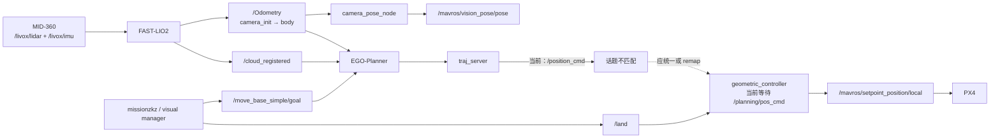
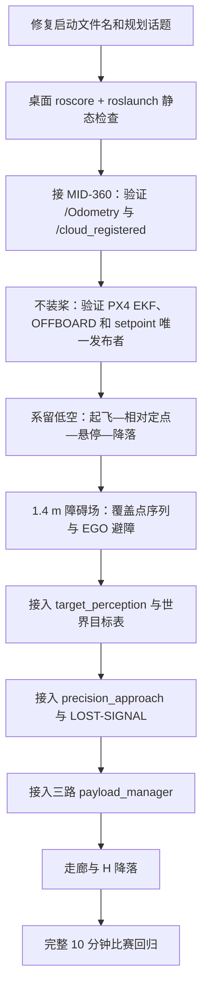

# Fast-Drone-250 与 ws_livox 现有项目完整说明

版本：V1.0  
审计日期：2026-07-29  
远端主机：`ubuntu@192.168.0.183`  
审计范围：`/home/ubuntu/Fast-Drone-250`、`/home/ubuntu/ws_livox`，重点检查 `px4ctrl`、FAST-LIO、EGO-Planner、MAVROS、视觉任务、定点任务与投放接口。

> 本文描述的是“远端当前实际存在的代码和环境”，不是理想架构说明。目标比赛逻辑见 [2026 RoboCup 无人机自主任务技术方案](superpowers/specs/2026-07-28-robocup-uav-autonomous-mission-design.md)。完整路径级清单见 [远端仓库文件清单](audit/2026-07-29-remote-repo-file-manifest.tsv)。

## 1. 结论先行

这台机载 Ubuntu 已经具备完成比赛系统的大部分底层组件：

- PX4 + MAVROS 飞控通信；
- MID-360 驱动；
- FAST-LIO2 激光惯性里程计和点云输出；
- LIO 位姿向 MAVROS 视觉位姿的桥接；
- EGO-Planner 局部避障；
- `geometric_controller` 起飞、任务位置控制、悬停和降落状态机；
- 定点任务脚本、自检、超时、失联、落地等安全逻辑；
- OpenVINO 装甲板检测、ROI 几何细化和四点 PnP 原型；
- `px4ctrl` 中的历史航点、目标跟随和三次顺序串口投放代码。

但“组件存在”不等于“2026 比赛任务已经完整打通”。当前快照存在两个可以直接阻断一键运行的接口问题：

1. 一键脚本启动 `single_run_in_exp_type1.launch`，实际仓库只有 `single_run_in_exp.launch`。
2. 当前 `traj_server` 发布 `/position_cmd`，而 `geometric_controller` 和任务脚本等待 `/planning/pos_cmd`，中间没有对应 remap。

此外，2026 所需的多类型靶标、六点/H 角点 PnP、搜索覆盖、目标优先队列、视觉下降接管、三路独立 PWM 舵机状态管理还没有形成一条端到端链路。准确结论是：

> 当前系统是“可复用底座已经比较完整，旧比赛原型和新任务脚本并存，但集成尚未闭环”。修复两个 P0 接口问题后可以恢复定点避障飞行基线；要直接参加 2026 比赛，还需补齐任务管理、视觉类型和投放执行层。

## 2. 审计范围和证据等级

本次只做了远端只读检查，没有修改远端源码、配置、设备或系统软件。

| 项目 | 数量或结果 |
|---|---:|
| `Fast-Drone-250` 路径条目 | 5,567 |
| `ws_livox` 路径条目 | 5,649 |
| 两工作空间文件 | 9,082 |
| 两工作空间目录 | 2,132 |
| 镜像的源码/配置/文档文本 | 1,431 |
| 识别出的 ROS 包 | 45 |
| 静态提取接口出现次数 | 878 |
| 发布/订阅/服务/参数 | 153 / 157 / 69 / 499 |

证据等级如下：

- **源码存在**：在路径清单和本地只读快照中确认；
- **已编译**：在 `devel/lib` 中确认可执行文件，并比较源码/二进制时间；
- **启动文件可解析**：通过远端 `roslaunch --files` 检查；
- **运行验证**：需要真实传感器和飞控在线。本次扫描时 ROS 栈未运行，MID-360、相机、舵机和 TFmini 未连接，因此不能声称整机实飞通过。

构建目录、日志、二进制和数据文件均进入完整路径清单和大小统计，但没有全部下载；源码、配置、脚本和文档被镜像后进行静态分析。

## 3. 主机、ROS 与硬件现状

### 3.1 软件环境

| 项目 | 当前状态 |
|---|---|
| 系统 | Ubuntu 20.04.6 LTS，x86_64，内核 5.15 |
| ROS | ROS Noetic，`/opt/ros/noetic/setup.bash` |
| 构建 | 两个工作空间均为 catkin_tools linked devel |
| MAVROS | 1.18，已安装 |
| Python | 3.8.10 |
| 编译器 | GCC/G++，CMake 3.26 |
| 内存/磁盘 | 7.3 GiB RAM，8 GiB swap；磁盘约 89 GiB 可用 |

两个工作空间不是干净、单一的 overlay。可靠加载方式应采用当前一键脚本中的显式合并逻辑：

```bash
set +u
source /opt/ros/noetic/setup.bash
source /home/ubuntu/ws_livox/devel/setup.bash
source /home/ubuntu/Fast-Drone-250/devel/local_setup.bash
set -u
export ROS_PACKAGE_PATH="/home/ubuntu/ws_livox/src:/home/ubuntu/Fast-Drone-250/src:${ROS_PACKAGE_PATH:-}"
export CMAKE_PREFIX_PATH="/home/ubuntu/ws_livox/devel:/home/ubuntu/Fast-Drone-250/devel:${CMAKE_PREFIX_PATH:-}"
```

按此顺序，`rospack find ego_planner` 能正确解析到：

```text
/home/ubuntu/Fast-Drone-250/src/planner/plan_manage
```

单纯依次 `source` 两个 `setup.bash` 可能覆盖前一个工作空间。`.bashrc` 中还有重复加载 Fast-Drone 的痕迹，建议比赛入口只调用一个统一的 `source_all`。

### 3.2 扫描时的设备状态

| 设备 | 扫描结果 | 影响 |
|---|---|---|
| PX4 FMU v6C.x | `/dev/ttyACM0`，存在稳定 by-id 链接 | MAVROS 串口基础具备 |
| MID-360 | USB 中未显示；以太网接口也没有 `192.168.1.50` | 当前不能与配置中的 `192.168.1.3` 雷达通信 |
| 相机 | 无 `/dev/video0` | 视觉链无法现场运行验证 |
| 舵机串口 | 无 `/dev/servo`、无 `/dev/ttyUSB0` | 投放接口无法现场验证 |
| TFmini | 无 `/dev/tfmini` | 当前启动配置本来也未启用其高度 |

Livox 配置写的是：

- 主机 IP：`192.168.1.50`
- MID-360 IP：`192.168.1.3`

扫描时现有接口为 `192.168.0.183/24` 和 `10.42.0.1/24`，有线口处于 DOWN，因此必须先完成网卡静态地址和雷达连通性检查。

udev 规则可把特定 USB 物理端口映射为 `/dev/servo` 和 `/dev/tfmini`，但旧 `serialDrop.cpp` 仍硬编码 `/dev/ttyUSB0`。这两个约定当前不一致，而且基于 USB 物理拓扑的规则换插口会失效。

## 4. 仓库拓扑：上游、原比赛代码、本地工具

### 4.1 `/home/ubuntu/Fast-Drone-250`

这是一个完整 Git 仓库：

- 分支：`master`
- HEAD：`8ff64274b161bb829653faf5946656658e7e2c9f`
- 上游：`https://github.com/ZJU-FAST-Lab/Fast-Drone-250`
- 上游提交时间：2022-11-09

可以把它分成四类：

| 类别 | 内容 | 判断 |
|---|---|---|
| 上游飞行底座 | EGO-Planner、VINS-Fusion、RealSense、仿真器、消息和工具库 | 原 Fast-Drone-250 |
| 原比赛/本地改动 | 修改后的 `px4ctrl`、`points*.yaml`、目标识别/串口投放原型、规划器参数 | Git dirty，部分为未跟踪文件 |
| 调试与历史副本 | 多个带日期/`copy`/`backup` 的 `PX4CtrlFSM`、空配置、实验节点 | 不应作为正式入口 |
| 构建产物 | `build`、`devel`、`logs` | 不是源码 |

被修改的跟踪文件集中在 EGO-Planner 参数/源码和 `px4ctrl` 核心；未跟踪内容包括多个航点 YAML、`tunnel_detect.launch`、`receive_point.cpp`、`recognize_node.cpp`、`serialDrop.*`、`video_detect_cv.*`、历史 FSM 副本和 `dense_cloud_filter`。

因此，`px4ctrl` 当前版本不能再视为纯上游控制器，它是旧比赛逻辑长期叠加后的本地分支。

### 4.2 `/home/ubuntu/ws_livox`

工作空间根目录不是 Git 仓库，而是多个嵌套仓库和未版本化集成文件的集合：

| 子仓库 | 上游 | 当前角色 |
|---|---|---|
| `LIO-Drone-250` | `zjz0001/LIO-Drone-250` | 当前控制器、FAST-LIO、任务脚本和视觉集成主体 |
| `faster-lio` | `gaoxiang12/faster-lio` | 另一套 LIO 备选；不是当前一键脚本使用的定位器 |
| `livox_ros_driver2` | Livox-SDK | MID-360 驱动，当前主动使用 |
| `TFmini-ROS` | TFmini | 可选高度传感器 |
| `ros_astra_camera-main/libuvc` | libuvc | Astra 相机驱动依赖 |

`LIO-Drone-250` 中控制器和 FAST-LIO 有本地修改，原仓库内嵌的 planner 源码已被删除；当前通过 overlay 实际使用 Fast-Drone-250 中的 `ego_planner`。大量 2026 年新增的任务脚本、视觉包、配置、测试和备份文件没有进入该嵌套仓库的正式版本历史。

`quadrotor_msgs` 在两个工作空间各有一份。逐个比较共同 `.msg` 文件后内容完全一致，因此当前没有消息 MD5 冲突；但运行时解析到的是 `ws_livox/LIO-Drone-250` 那份，长期仍建议只保留一个权威来源。

## 5. ROS 包清单与用途

### 5.1 Fast-Drone-250：33 个包

| 分组 | 包 | 用途 |
|---|---|---|
| 规划 | `ego_planner`、`bspline_opt`、`path_searching`、`plan_env`、`traj_utils` | 地图、搜索、B 样条优化和轨迹输出 |
| 飞控 | `px4ctrl` | 旧低层控制/任务状态机/MAVROS 输出 |
| 定位备选 | `vins`、`global_fusion`、`loop_fusion`、`camera_models` | VINS-Fusion；当前 MID-360 主链不使用 |
| 传感器 | `realsense2_camera`、`realsense2_description`、`dense_cloud_filter` | RealSense 与点云工具 |
| 仿真 | `local_sensing_node`、`map_generator`、`mockamap`、`so3_control`、`so3_quadrotor_simulator`、`poscmd_2_odom`、`odom_visualization` | 离线/仿真验证 |
| 公共工具 | `quadrotor_msgs`、`uav_utils`、`pose_utils`、`rviz_plugins`、`DecompROS`、`rosmsg_tcp_bridge` 等 | 消息、数学、可视化和桥接 |

其中 `catkin_simple` 自带的 `foo/bar/baz` 是库测试样例，不是无人机功能。

### 5.2 ws_livox：12 个包

| 包 | 当前角色 |
|---|---|
| `livox_ros_driver2` | MID-360 点云与 IMU 驱动 |
| `fast_lio` | 当前 FAST-LIO2 定位和注册点云 |
| `camera_pose_node` | `/Odometry` 转 `/mavros/vision_pose/pose` |
| `geometric_controller` | 起飞、任务位置设定、悬停和降落 |
| `armor_follow_openvino` | YOLO/OpenVINO + 装甲板 PnP 视觉原型 |
| `controller_msgs`、`quadrotor_msgs` | 控制消息 |
| `faster_lio` | LIO 备选，不在当前主启动链 |
| `livox_ros_driver` | faster-lio 内旧驱动依赖 |
| `tfmini_ros` | 可选测高 |
| `astra_camera` | Astra 相机驱动 |
| `lidar_slam` | 实验性全局/回环工具；存在 `CATKIN_IGNORE`，当前未构建、未启用 |

## 6. 当前定位、建图、避障与控制链

### 6.1 推荐理解的当前主链



### 6.2 FAST-LIO2

当前 `mapping_mid360.launch` 使用：

- 点云：`/livox/lidar`
- IMU：`/livox/imu`
- 输出里程计：`/Odometry`
- 注册点云：`/cloud_registered`
- TF：`camera_init -> body`
- 外参估计：关闭
- 平移外参：`[-0.011, -0.02329, 0.04412]`
- 旋转外参：单位阵

它还发布 `/cloud_registered_body`、`/cloud_effected`、`/Laser_map`、`/path`、`/lidar_pose`。

`camera_pose_node` 不是 VIO。它将 FAST-LIO 的 `/Odometry` 位姿转发到 `/mavros/vision_pose/pose`，供 PX4 EKF 融合。当前配置 `use_range_height=false`，不使用 TFmini 高度。

需要注意：

- 桥接中没有显式处理所有 ENU/NED 和启动朝向差异，必须通过实机静态、平移和转向试验验证轴向；
- FAST-LIO 配置中 `pcd_save_enable=true` 且间隔为 `-1`，源码注释已经提示长时间可能导致内存压力，比赛配置应关闭持续 PCD 保存。

### 6.3 EGO-Planner

实际存在的实飞启动文件是：

```text
/home/ubuntu/Fast-Drone-250/src/planner/plan_manage/launch/single_run_in_exp.launch
```

核心参数包括：

- 里程计：`/mavros/local_position/odom`
- 点云：`/cloud_registered`
- 目标：`/move_base_simple/goal`
- `flight_type=1`
- 最大速度/加速度：3 m/s、3 m/s²
- 规划视野：6 m
- 地图：30 × 30 × 5 m
- 分辨率：0.045 m
- 膨胀：0.23 m
- 地面高度：0.15 m
- 最大射线：5 m

这些是原项目/实验参数，不是已经针对 1.4 m 搜索、1.5 m 障碍和狭窄走廊验收过的比赛参数。

### 6.4 两套控制器不能同时运行

仓库中存在两条控制输出链：

| 控制链 | 输入 | 对 MAVROS 输出 | 当前定位 |
|---|---|---|---|
| `px4ctrl` | `/position_cmd` | 原始姿态或位置 setpoint | 旧 Fast-Drone/旧比赛状态机 |
| `geometric_controller` | `planning/pos_cmd` | 当前任务模式主要为位置 setpoint | 新 LIO 任务脚本使用 |

两者都可能向 MAVROS setpoint 话题发布，绝不能同时启动。比赛架构必须指定唯一控制所有者。

当前 `geometric_controller` 启动参数 `mission_position_setpoint=true`，所以任务执行阶段主要将规划位置指令送入 PX4 位置控制器；并非始终使用其几何 body-rate 控制律。它提供：

- `WAITING_HOME`
- `TAKING_OFF`
- `MISSION_EXECUTION`
- `MISSION_HOLD`
- `LANDING`
- `LANDED`

全局 `/land` 为 `std_srvs/SetBool` 服务。降落时锁定 x/y，低于约 0.12 m 后切 `AUTO.LAND`。

## 7. 定点飞行：现有方法和当前阻断点

### 7.1 任务脚本方式

正式候选是：

```text
/home/ubuntu/ws_livox/src/LIO-Drone-250/shfiles/missionzkz.py
```

它包含自检、OFFBOARD、解锁、起飞稳定判断、定点、规划器新鲜度/卡死判断、悬停、落地和安全限制。支持绝对点和相对起点：

```bash
python3 /home/ubuntu/ws_livox/src/LIO-Drone-250/shfiles/missionzkz.py \
  --waypoint 2.0,1.0,1.4,2.0,30.0
```

```bash
python3 /home/ubuntu/ws_livox/src/LIO-Drone-250/shfiles/missionzkz.py \
  --relative-waypoint 1.0,0.0,1.4,2.0,30.0
```

字段依次为 `x,y,z,hold_sec,timeout_sec`。相对点以任务启动时的原点为基准；绝对点属于当前启动后的局部世界系，并不是固定地理坐标。

必须先执行 `--dry-run` 检查解析结果：

```bash
python3 /home/ubuntu/ws_livox/src/LIO-Drone-250/shfiles/missionzkz.py \
  --relative-waypoint 1.0,0.0,1.4,2.0,30.0 --dry-run
```

现有 `simple_nav_30cm.json` 是 0.3 m 起飞、0.45 m 最大高度的低空测试配置，不可直接用于 1.4 m 比赛。

### 7.2 直接发 EGO 目标

在控制链修通、飞行安全员就位且已进入任务状态后，可用标准目标话题定点：

```bash
rostopic pub -1 /move_base_simple/goal geometry_msgs/PoseStamped \
"{header: {frame_id: 'world'}, pose: {position: {x: 2.0, y: 1.0, z: 1.4}, orientation: {w: 1.0}}}"
```

这只是给 EGO-Planner 一个目标，不负责起飞、解锁、落地、任务超时和舵机，所以正式比赛应由任务管理器调用，不能把 `rostopic pub` 当完整任务系统。

### 7.3 旧 `px4ctrl` YAML 方式

`px4ctrl/launch/run_ctrl.launch` 加载：

- `ctrl_param_fpv.yaml`
- `points.yaml`

历史 `points_sorted.yaml` 中有 z=1.5 m 的往返扫描点；`three_points.yaml`、`two_points.yaml` 等体现旧比赛投放航点。当前 `points.yaml` 重复往返 `(7.2,-3.9,1)` 和原点，且投放标志为 0；`two_points.yaml` 有空坐标项。

旧方式理论上会依次向 `/move_base_simple/goal` 发布 YAML 航点，但不建议直接复用为 2026 主任务，原因见下一节。

### 7.4 一键启动现状

两个候选入口：

```text
start_stackzkz.sh
start_visual_nav_system.sh
```

均通过 `bash -n`，Shell 语法正确；但两者都要求：

```bash
roslaunch ego_planner single_run_in_exp_type1.launch
```

远端 `roslaunch --files` 已确认：

- `single_run_in_exp.launch` 可以解析；
- `single_run_in_exp_type1.launch` 不存在。

即使改正文件名，`traj_server` 当前也只发布 `/position_cmd`，而控制器和任务脚本等待 `/planning/pos_cmd`。因此在这两个问题修复并重新编译/验证前，一键任务不能宣称可用。

## 8. `px4ctrl` 深入说明

### 8.1 它提供的接口

`run_ctrl.launch` 将 `~cmd` remap 到 `/position_cmd`。节点订阅：

- `/mavros/local_position/odom`
- `/mavros/imu/data`
- `/mavros/rc/in`
- `/mavros/battery`
- `/mavros/state`
- `/mavros/extended_state`
- 私有 `takeoff_land`

节点可以发布：

- `/mavros/setpoint_raw/attitude`
- `/mavros/setpoint_position/local`
- `/move_base_simple/goal`
- `/traj_start_trigger`
- `/debugPx4ctrl`

并调用 MAVROS 的模式、解锁和命令服务。

### 8.2 旧比赛状态机

当前编译入口调用 `fsm.process()`，其他 `process1/process3` 或多个带日期的 FSM 文件不是活动入口。活动 FSM 中有：

- 自动起飞/悬停；
- 按 YAML 顺序发布目标；
- 目标/视觉跟随的历史分支；
- `DROP_FALL`、上升恢复等投放状态；
- 任务事件日志；
- 高度超过约 2.1 m 时进入自动降落的硬编码保护。

这些逻辑反映的是旧场地和旧任务，不应与 2026 的 1.4 m 搜索、随机靶和走廊决策直接混用。

### 8.3 已确认的代码问题

1. `px4ctrl_node.cpp` 读取 `if_fall_i` 到变量 `k` 后，立即执行 `fsm.if_fall[i]=0`，没有把 `k` 写入数组；配置中的投放标志全部被忽略。
2. `PUB_CTRL` 中发布 `goals[step]` 后 `step++`，后续又使用 `if_fall[step]`、`aim_bias[step]` 等，存在索引语义错位和越界风险。
3. `PX4CtrlFSM` 内有一个 `Droper` 成员，`PX4CtrlFSM.cpp` 又定义全局 `Droper droper`，可能重复打开同一串口。
4. `serialDrop.cpp` 固定打开 `/dev/ttyUSB0`，与 `/dev/servo` udev 规则不一致。
5. `Drop()` 按调用次数依次发送 ASCII `c`、`d`、`b`，第四次发送 `e`，没有按“舵机 ID”选择、没有确认回复、没有锁存状态、没有重试幂等语义。
6. `open_node` 是连续释放/全开测试工具，不是比赛安全服务。
7. `receive_point.cpp`、`recognize_node.cpp` 等是未纳入活动 CMake 的原型。
8. `tunnel_detect.launch` 引用 `custom_to_cloud_node` 和 `detect`，但当前 `px4ctrl` CMake 没有生成这两个可执行程序。

结论：旧串口代码证明硬件协议曾考虑三个投放通道，但它不是当前要求的“三个独立普通 PWM 舵机状态管理器”。

## 9. 现有任务脚本分类

| 文件/类型 | 分类 | 作用 |
|---|---|---|
| `start_stackzkz.sh` | 当前候选入口 | MAVROS、Livox、FAST-LIO、位姿桥、控制器、规划器的进程管理 |
| `missionzkz.py` | 当前定点任务主体 | 自检、起飞、定点、悬停、落地、安全策略 |
| `start_visual_nav_system.sh` | 当前视觉候选入口 | 在基础栈上增加 V4L2/OpenVINO 视觉 |
| `mission_armor_visual_manager.py` | 当前视觉任务原型 | 探索、视觉锁定、目标跟随、落地 |
| `armor_visual_30cm.json` | 视觉测试配置 | 实际使用 0.8 m，而文件名仍写 30 cm |
| `mission_visual_probe_follow.py`、`mission_visual_nav_follow.py` | 早期原型 | 视觉探测/跟随试验 |
| `mission_circle.py`、`circle_trajectory.py` | 工具/试验 | 圆轨迹和控制链验证 |
| `takeoff_land_smoke.py`、`motor_test_check.py` | 安全试验 | 起降和电机检查 |
| `test_*.py` | 静态/单元测试 | 任务和控制安全断言 |
| `.bak_*`、带日期副本 | 历史备份 | 迭代快照，不是运行入口 |
| `Planner.sh`、`SSH/ssh_uav1/*` | 旧启动工具 | 仍引用不存在的 type1 启动文件 |

当前主 Python 任务脚本能够通过 Python 3 语法解析。全快照 84 个 `.py` 中有 3 个旧上游 Python 2 工具无法由 Python 3 解析，分别属于推力标定、ODE 性能样例和旧 `tf_assist.py`，不在当前比赛主链。

162 个 XML/launch/package 文件均能被 XML 解析。47 个 YAML 中，4 个 VINS/OpenCV `%YAML:1.0` 文件不被通用 PyYAML 接受，但这是 OpenCV YAML 方言，不代表当前 LIO 主链配置损坏。

## 10. 视觉能力：已有部分与缺口

### 10.1 已有能力

`armor_follow_openvino` 已具备：

- YOLO/OpenVINO 推理；
- 装甲板 ROI；
- 灯条/角点细化；
- 小/大装甲板四点 PnP；
- 目标状态、跟踪、粗跟踪、丢失、坏 PnP 等状态；
- 将候选目标转成世界坐标附近的 follow goal；
- 由任务管理器过滤并转发 `/move_base_simple/goal`，视觉节点不直接控制飞控。

OpenVINO 模型 XML/BIN 文件存在。当前视觉管理器保留最后目标、丢失超时和导航接管的部分思想。

### 10.2 不能误认为已经实现的能力

当前没有完整实现：

- 所有 2026 靶标类型的 YOLO 类别和统一消息；
- 装甲车图案六个黑条点的 PnP；
- 起飞/降落 H 板的 H 边角点 PnP；
- 红十字小靶的专用几何 PnP；
- 图像时间与 LIO 位姿的严格时间对齐；
- 多观测目标数据库、重复目标合并和协方差；
- 搜索覆盖地图和随机起飞点下的完整覆盖策略；
- “最高优先级三个随机靶 + 两个 1 m 靶”队列；
- 视觉引导下降、预期丢失和异常丢失分支；
- 投放完成后自动进入走廊/过门/最终 H 降落的总状态机。

相机内参仍可能使用占位值，配置含 `extrinsic_unverified: true`；45°安装旋转近似存在，但没有完成实机标定验收。主启动使用 V4L2 且 `use_camera_info=false`，因此必须先标定全局快门相机内参、畸变和 `T_body_camera`。

## 11. 三路舵机与重力投放

用户定义的目标执行器是三个独立普通 PWM 舵机、重力释放。建议的比赛接口应是一个独立 `payload_manager`，而不是让控制 FSM 直接写串口：

| 接口 | 语义 |
|---|---|
| `arm_payload(channel)` | 将指定通道置为可释放状态 |
| `release(channel, target_id, command_id)` | 单通道、单次、幂等释放 |
| `payload_state` | `LOADED_ASSUMED / ARMED / RELEASE_COMMANDED / EMPTY_ASSUMED / FAULT` |
| `safe_all()` | 三路回安全角 |

普通 PWM 舵机没有物理释放反馈，所以成功状态只能是 `EMPTY_ASSUMED`，不能记录“确认命中”或“确认释放”。比赛状态机可以按用户策略“不论是否命中都不重复投”，但日志应写“已尝试释放”。

现有 `serialDrop` 可以作为底层协议参考，不能直接作为这一接口的最终实现。

## 12. 当前比赛能力矩阵

| 能力 | 状态 | 说明 |
|---|---|---|
| PX4/MAVROS 通信 | 已具备，待在线复测 | PX4 串口存在 |
| MID-360 驱动 | 代码/配置/二进制具备 | 当前网卡地址不满足配置 |
| FAST-LIO2 | 代码/配置/二进制具备 | 主动定位方案，不是 VIO |
| LIO → PX4 EKF | 已有桥接 | 坐标轴和时间戳需实机验收 |
| 注册点云避障 | 组件具备 | 需恢复 EGO 启动和话题链 |
| 定点飞行 | 任务代码具备 | 被启动文件名和话题错配阻断 |
| 起飞/悬停/降落 | 控制器和任务逻辑具备 | 需整链复测 |
| 旧投放 | 原型具备 | 有确定 bug，不可直接比赛 |
| 三路独立 PWM 状态管理 | 缺失 | 需新建 payload manager |
| 装甲板识别/PnP | 原型具备 | 四点 PnP，标定未确认 |
| 2026 全类别和 H/红十字 PnP | 缺失 | 需新增 |
| 覆盖搜索与目标队列 | 缺失 | 目标方案文档已有，代码未见 |
| 视觉下降 + LIO 终端桥接 | 部分思想存在 | 没有完整状态机 |
| 走廊识别/过门 | 缺失或旧原型不可用 | `tunnel_detect` 不可构建 |
| 最终 H 精准降落 | 缺失 | 现有 `/land` 仅位置保持下降 |

## 13. 阻断项和修复优先级

### P0：不修不能建立比赛基线

1. 将一键脚本中的 EGO 启动文件统一到真实存在且经审核的 launch。
2. 统一规划轨迹话题：在 `/position_cmd` 和 `/planning/pos_cmd` 中选一个权威名称，并在 launch 明确 remap。
3. 明确唯一控制器：比赛主链选择 `geometric_controller` 或 `px4ctrl`，禁止双发布 MAVROS setpoint。
4. 配置 MID-360 网卡 `192.168.1.50/24`，验证雷达 `192.168.1.3`；接入并固定 PX4、相机、舵机设备名。
5. 新建 2026 总任务管理器：搜索、目标队列、插入投放、走廊、H 降落、时间预算。
6. 新建三路独立舵机执行层，废止顺序 `throwCount` 作为上层接口。

### P1：比赛可靠性

1. 标定相机内参、畸变、45°外参，验证图像时间同步。
2. 验证 LIO 世界系与 MAVROS/PX4 的轴向、航向和高度一致性。
3. 关闭比赛时 PCD 全量保存，限制日志和磁盘写入。
4. 修复 `px4ctrl` 投放标志、索引和重复串口对象；若主链不用它，则隔离旧任务状态机。
5. 建立 LOST-SIGNAL 的“预期丢失/异常丢失”分支和短距离 LIO 桥接上限。
6. 针对 1.4 m 搜索、1.5 m 障碍、机体尺寸和刹车距离重新标定 EGO 膨胀、速度和局部地图。

### P2：工程治理

1. 将 `ws_livox` 根目录纳入一个总集成仓库或用 `.repos` 固定子仓库版本。
2. 将 `.bak_*`、构建产物、日志和数据移出源码树。
3. 消除重复 `quadrotor_msgs`，固定 overlay 入口。
4. 给启动链、话题契约、标定和舵机协议建立可重复测试。

## 14. 建议的最短集成路径



第一阶段不要同时改规划、控制、视觉和舵机。先恢复一个可观测、可重复的“相对定点闭环”，再逐层加功能。

## 15. 比赛前唯一允许的启动检查表

在完成 P0 修复后，每次正式飞行至少检查：

```bash
rospack find ego_planner
roslaunch --files ego_planner <最终实飞launch文件>
rostopic info /position_cmd
rostopic info /planning/pos_cmd
rostopic info /mavros/setpoint_position/local
rostopic hz /livox/lidar
rostopic hz /livox/imu
rostopic hz /Odometry
rostopic hz /cloud_registered
rostopic hz /mavros/vision_pose/pose
rosnode list
```

验收条件：

- 规划命令只有一个权威话题；
- MAVROS setpoint 只有一个控制发布者；
- LIO、点云、视觉位姿频率稳定；
- PX4 未解锁时完成全部静态检查；
- 舵机通道逐个台架验证，飞行前回安全角；
- 任务配置中的 `max_height`、起飞高度和搜索高度与 1.4 m 方案一致；
- 10 分钟全流程回归通过后才冻结比赛版本。

## 16. 审计附件和可追溯性

- 路径级清单：[2026-07-29-remote-repo-file-manifest.tsv](audit/2026-07-29-remote-repo-file-manifest.tsv)
- 目标比赛设计：[2026-07-28-robocup-uav-autonomous-mission-design.md](superpowers/specs/2026-07-28-robocup-uav-autonomous-mission-design.md)
- 本次审计执行计划：[2026-07-29-remote-ros-repository-audit.md](superpowers/plans/2026-07-29-remote-ros-repository-audit.md)

本次确认的关键二进制均存在，且时间晚于相应活动源码：

- `devel/lib/px4ctrl/px4ctrl_node`
- `devel/lib/ego_planner/ego_planner_node`
- `devel/lib/ego_planner/traj_server`
- `devel/lib/geometric_controller/geometric_controller_node`
- `devel/lib/fast_lio/fastlio_mapping`
- `devel/lib/armor_follow_openvino/armor_follow_node`
- `devel/lib/livox_ros_driver2/livox_ros_driver2_node`

这证明主要组件曾被当前工作空间成功编译，但不改变本文对一键启动阻断和比赛集成缺口的判断。
